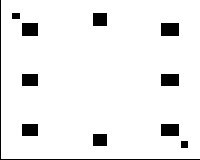

# Monte Carlo Localization — Puzzlebot en Almacén

**Autor:** Valeria Cerda  
**Fecha:** Mayo 2026

---

## Descripción

Implementación de **Monte Carlo Localization (MCL)** para un robot diferencial
Puzzlebot en un entorno de almacén simulado en **Gazebo Fortress** con **ROS 2 Humble**.

El robot se localiza dentro de un mapa PNG conocido usando un filtro de partículas:
cada partícula es una hipótesis de pose `(x, y, θ)`. Sus pesos se actualizan con
la verosimilitud de la lectura del LiDAR contra el mapa, y se re-muestrean
iterativamente hasta converger en la pose real del robot.

---

## Video de demostración

📹 **[Ver video](./video/mcl_demo.mp4)**

El video muestra:
1. El mapa conocido del almacén (`warehouse_map.png`)
2. El robot Puzzlebot moviéndose por el almacén en Gazebo Fortress
3. Las partículas MCL en RViz convergiendo hacia la pose real del robot
4. Los logs de pose estimada en terminal: `x, y, θ`

---

## Entorno — Almacén de Pallets

El entorno simulado es un almacén de **10 × 8 m** que contiene:

- **3 filas de pallets** (A, B, C) en posiciones asimétricas para generar features distintos con el LiDAR
- **2 pilares** en esquinas opuestas (rompen la simetría → mejor convergencia MCL)
- **Pasillos libres** para navegación del robot
- **Paredes perimetrales** de 0.15 m de grosor

El mapa conocido del entorno:



> Blanco = espacio libre | Negro = obstáculo (paredes, pallets, pilares)

---

## Pasos de la actividad implementados

| Paso | Descripción | Implementación |
|------|-------------|----------------|
| **A** | Simulador Gazebo Fortress | `worlds/warehouse.sdf` lanzado con `ign gazebo` |
| **B** | Layout del entorno conocido | `maps/warehouse_map.png` generado desde `generate_warehouse_map.py` |
| **C** | Dimensiones del grid | **0.05 m/pixel**, mapa 200×160 px = 10×8 m, origen (-5.0, -4.0) m |
| **D** | Muestreo de partículas | `src/mcl.py → _sample_uniform()` — 2000 partículas uniformes en celdas libres |
| **E** | Puntaje por partícula | `src/mcl.py → _score()` — likelihood field gaussiano: distancia del endpoint de cada rayo LiDAR al obstáculo más cercano |
| **F** | Filtrado | `src/mcl.py → _resample()` — conserva top 500, low-variance resampling sobre los mejores |
| **G** | Dead reckoning | `src/mcl.py → cb_odom()` — modelo cinemático diferencial: calcula Δd y Δθ desde `/model/puzzlebot/odometry` |
| **H** | Mover partículas | `src/mcl.py → step()` — aplica Δd/Δθ + ruido gaussiano a cada partícula |
| **I** | Iterar | Timer ROS 2 a **10 Hz** repite el ciclo continuamente |

---

## Fundamento teórico

### Modelo cinemático diferencial (Pasos G, H)

Para un robot diferencial, la pose se propaga así:

```
x_k     = x_{k-1}     +  Δd · cos(θ_{k-1})
y_k     = y_{k-1}     +  Δd · sin(θ_{k-1})
θ_k     = θ_{k-1}     +  Δθ
```

donde `Δd = sqrt(Δx² + Δy²)` y `Δθ` se obtienen comparando poses consecutivas
de la odometría. Se añade ruido gaussiano `N(0, σ)` para modelar la incertidumbre
del movimiento real.

### Regla de Bayes (Paso E)

Cada partícula recibe un peso proporcional a su verosimilitud:

```
P(x | z) ∝ P(z | x) · P(x)
posterior ∝ likelihood  · prior
```

El **likelihood** `P(z | x)` se calcula con un **likelihood field**: para cada
rayo del LiDAR se proyecta el endpoint en el mapa y se mide la distancia al
obstáculo más cercano. El peso es una gaussiana sobre esa distancia:

```
w_i = exp( -0.5 · (d / σ_hit)² )
```

sumada sobre todos los rayos usados.

### Modelo Oculto de Markov — ciclo MCL (Pasos D–I)

```
Predicción:   x_t  =  f(x_{t-1}, u_t)  +  ruido      ← Pasos G, H
Corrección:   w_t  ∝  P(z_t | x_t)                   ← Paso E
Resampling:   x_t' ~  {x_t^i} con prob ∝ w_t^i       ← Paso F
```

---

## Parámetros del sistema

### Mapa (Paso C)

| Parámetro | Valor |
|-----------|-------|
| Resolución | 0.05 m/pixel |
| Tamaño imagen | 200 × 160 px |
| Tamaño mundo | 10.0 × 8.0 m |
| Origen X | -5.0 m |
| Origen Y | -4.0 m |

### Filtro de partículas

| Parámetro | Valor | Descripción |
|-----------|-------|-------------|
| `N_PARTICLES` | 2000 | Total de partículas |
| `N_KEEP` | 500 | Mejores a conservar por iteración |
| `SIGMA_HIT` | 0.30 m | Desviación del modelo de sensor |
| `N_RAYS` | 36 | Rayos del LiDAR usados por iteración |
| `SIGMA_XY` | 0.05 m | Ruido traslacional del movimiento |
| `SIGMA_THETA` | 0.05 rad | Ruido rotacional del movimiento |
| Frecuencia | 10 Hz | Velocidad del loop MCL |

---

## Estructura del repositorio

```
montecarlo-localization/
├── README.md                      ← Este archivo
├── worlds/
│   └── warehouse.sdf              ← World Gazebo Fortress (almacén 10×8 m)
├── maps/
│   ├── generate_warehouse_map.py  ← Genera warehouse_map.png desde las coords del SDF
│   └── warehouse_map.png          ← Mapa 2D conocido (200×160 px, 0.05 m/px)
├── robot/
│   ├── puzzlebot_gz.sdf           ← SDF del robot Puzzlebot (Gazebo Fortress)
│   └── meshes/                    ← Mallas STL del robot
├── src/
│   ├── mcl.py                     ← Nodo principal MCL — implementa pasos D–I
│   └── demo_mcl.py                ← Demo visual paso a paso con OpenCV
├── run_all.sh                     ← Lanza todo el stack automáticamente
├── launch.sh                      ← Launcher alternativo
└── video/
    └── mcl_demo.mp4               ← Video de demostración
```

---

## Cómo correr

### Requisitos

- Ubuntu 22.04
- ROS 2 Humble (`ros-humble-desktop`)
- Gazebo Fortress (`ignition-fortress`)
- Bridge: `ros-humble-ros-gz`
- Python 3: `numpy`, `opencv-python`
- Repositorio `puzzlebot_sim` compilado en `~/puzzlebot_sim` (para los meshes del robot)

### Opción 1 — Script automático

```bash
bash run_all.sh
```

Luego presiona **▶** en Gazebo y mueve el robot con el teleop (`i` = adelante, `j/l` = girar).

### Opción 2 — Manual (5 terminales)

```bash
# Terminal 1 — Gazebo
source /opt/ros/humble/setup.bash
ign gazebo -v 4 worlds/warehouse.sdf

# Terminal 2 — Bridge ROS 2 <-> Gazebo Fortress
source /opt/ros/humble/setup.bash
ros2 run ros_gz_bridge parameter_bridge \
  /scan@sensor_msgs/msg/LaserScan[ignition.msgs.LaserScan \
  /model/puzzlebot/odometry@nav_msgs/msg/Odometry[ignition.msgs.Odometry \
  /model/puzzlebot/cmd_vel@geometry_msgs/msg/Twist]ignition.msgs.Twist \
  /clock@rosgraph_msgs/msg/Clock[ignition.msgs.Clock

# Terminal 3 — Nodo MCL
source /opt/ros/humble/setup.bash
python3 src/mcl.py

# Terminal 4 — Teleop
source /opt/ros/humble/setup.bash
ros2 run teleop_twist_keyboard teleop_twist_keyboard \
  --ros-args --remap cmd_vel:=/model/puzzlebot/cmd_vel

# Terminal 5 — RViz
source /opt/ros/humble/setup.bash
rviz2
# Configurar: Fixed Frame=map | Add PoseArray topic=/mcl/particles | Add Pose topic=/mcl/pose
```

### Demo visual paso a paso (sin ROS)

```bash
python3 src/demo_mcl.py
```

Muestra el mapa con las partículas en cada paso del algoritmo usando OpenCV.

---

## Tópicos ROS 2

| Tópico | Tipo | Dirección | Descripción |
|--------|------|-----------|-------------|
| `/scan` | `sensor_msgs/LaserScan` | Gazebo → MCL | Lectura del LiDAR 360° |
| `/model/puzzlebot/odometry` | `nav_msgs/Odometry` | Gazebo → MCL | Pose y velocidad del robot |
| `/model/puzzlebot/cmd_vel` | `geometry_msgs/Twist` | Teleop → Gazebo | Comandos de velocidad |
| `/mcl/particles` | `geometry_msgs/PoseArray` | MCL → RViz | Nube de 2000 partículas |
| `/mcl/pose` | `geometry_msgs/PoseStamped` | MCL → RViz | Estimación de pose actual |

---

## Referencias

- Thrun, S., Burgard, W., Fox, D. *Probabilistic Robotics*. MIT Press, 2005. Capítulos 4, 6, 8.
- Russell, S., Norvig, P. *Artificial Intelligence: A Modern Approach*, 2009. Capítulo 25.
- MathWorks. *Monte Carlo Localization Algorithm*. https://www.mathworks.com/help/nav/ug/monte-carlo-localization-algorithm.html
- Open Robotics. *Gazebo Fortress Documentation*. https://gazebosim.org/docs/fortress
